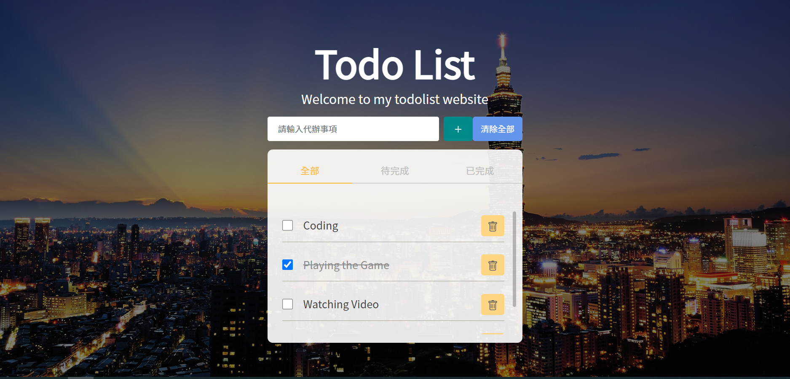

# Todo List Project

## Description

Todo List is my project to practice `Javascript` and `Sass/SCSS`, user can add、delete and update tasks in this project.

## Build with

- `HTML5`
- use Sass/SCSS of CSS preprocessor to handle `CSS3`
- `Javascript`
- Responsive by `@media` Media Queries for mobile, tablet, laptop ( use Bootstrap5](https://getbootstrap.com/) )

## Features

- Create(Add) and deklete tasks
- Each Task have checkbox, checked tasks will be considered completed, tasks that are not checked will be considered pending
- User can clear all tasks
- User can switch status button freely to view task status
- Tasks are divided into three categories : **All**, **Completed** and **Pending**
- Tasks and projects are managed with `localStorage`

## Links

Here are the relevant links that I browsed : 

- [Todo List Example](https://easonwu828.github.io/Todo-List/)
- [Create A Todo List App in HTML CSS & JavaScript | Todo App in JavaScript - YouTube](https://www.youtube.com/watch?v=2QIMUBilooc)